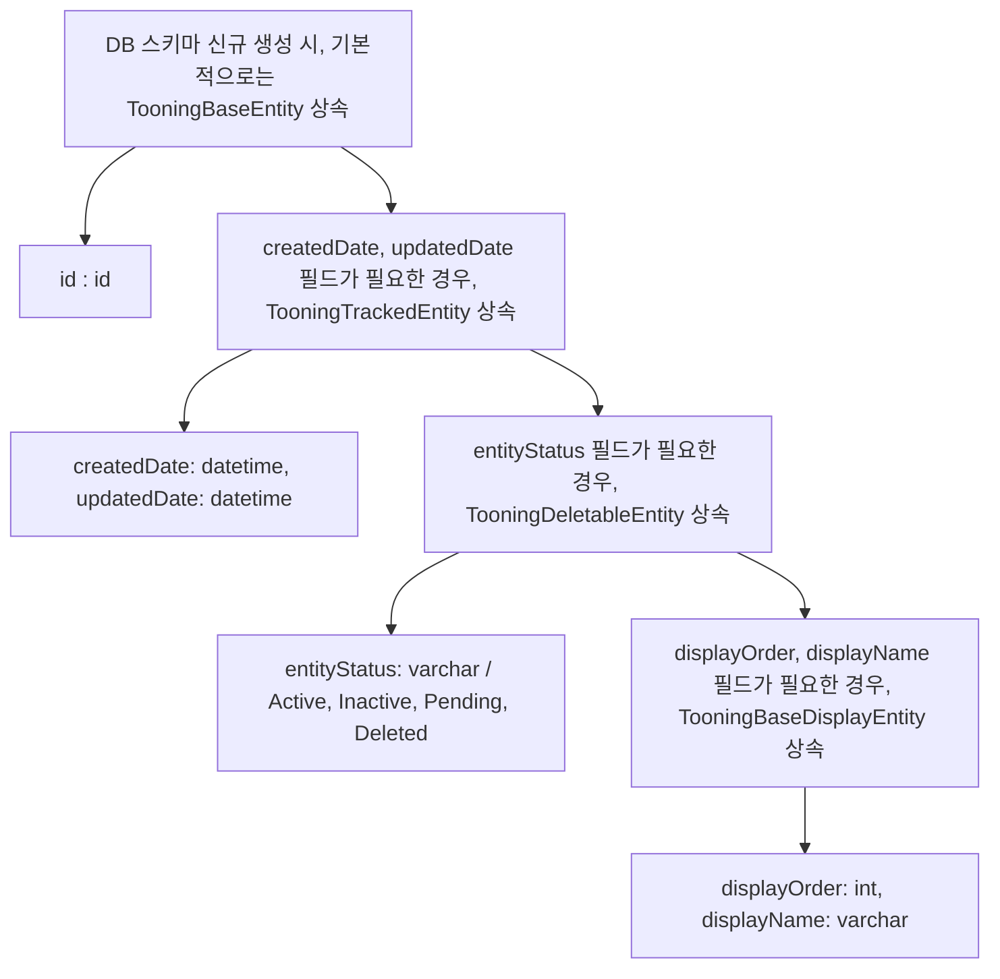
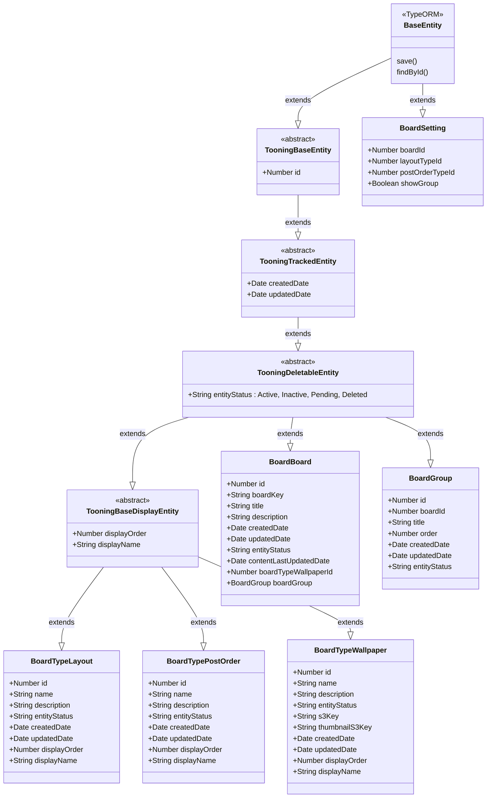
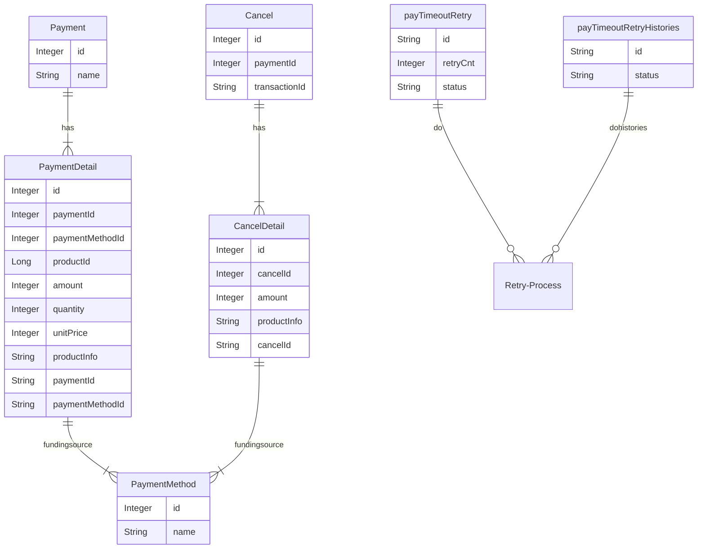
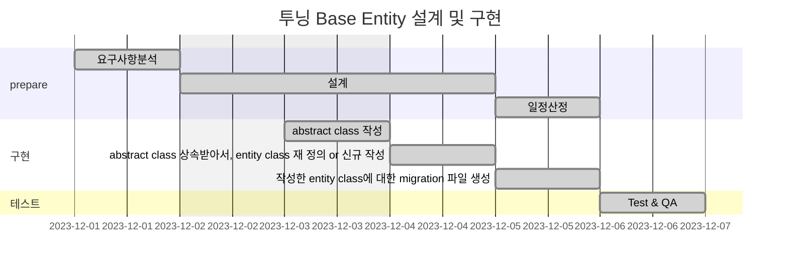

# 🚀 Project 관리

> mermaid로 작성된 과제는 마크다운 파일(Project.md)로 올려주시면 됩니다. (md 파일 내에 기존 구조를 넣어주세요)  
> 별도 아키택쳐나 모델링 도구를 사용한 경우에는 마크다운 파일(Project.md)과 png, gif, jpg, pdf 파일 형식으로 Project-{gitID}.png 파일명으로 upload 해주세요

# 요구사항

- [X] 개선하려는 프로젝트의 최종 설계
  - 3주차에 작성한 markdown파일을 그대로 사용
- [X] task list 도출
  - 3주차에 작성한 markdown파일을 그대로 사용
- [X] 일정 계획 문서 (WBS)
  - 3주차에 작성한 markdown파일을 그대로 사용
- [X] issue list
  - 프로젝트를 진행 하는 과정에서 발생한 이슈가 있다면 작성.

# 🚀미션

1. 3주차 미션에 진행된 ToBe 개선 프로젝트 WBS를 기반으로 향후 4주간 개선 작업을 진행한다.
2. 매주 토요일까지 개선된 프로젝트의 진행사항을 Github으로 PR을 요청하고 코치의 리뷰를 받는다.
    1. 미션을 진행하면서 기술적인 어려움이나 이슈사항이 있다면 이슈사항을 작성하고 리뷰를 진행한다.
    2. WBS상에서 진행된 과제들은 'Done'으로 상태를 update한다.
3. 이슈 사항이 있을 경우 설계의 수정이나 일정의 변경이 필요하면 수정 한다.
4. 수정된 계획을 기반으로 다음주 개선작업을 진행하고 1~4의 과정을 4주간 반복한다.

## 실무계선 Project

### 실무계선 Project 기대효과 분석

- 신규 테이블 생성시, Base Entity를 상속받아서, 사용하면, DB 칼럼명, 타입을 변경할 때, 편리함
- 자주 사용하는 칼럼의 경우, 용어 통일이 가능함
- entity status 와 같은 경우, abstract class 에서, deleteEntity 라는 메소드를 만들어서, 상속받아서 사용하면, 편리함

### 실무계선 Project 프로세스

### class diagram

- class diagram

### ERD

- 실무계선 Project 구조에서 변경되는 ERD를 작성한다.

## Task List

1. abstract class 설계 - TooningBaseEntity, TooningTrackedEntity, TooningDeletableEntity, TooningBaseDisplayEntity
2. 1에서 설계한 abstract class 작성
3. 변경 가능한 범위 내에서, abstract class 상속 받아서, entity class 재 정의 or 신규 작성
4. 작성한 entity class에 대한 migration 파일 생성

## WBS

1. 요구사항 분석 : 1d
2. 설계 : 1d
3. 일정산정: 1d
4. abstract class 작성 : 0.5d
5. abstract class 상속받아서, entity class 재 정의 or 신규 작성 : 1d
6. 작성한 entity class에 대한 migration 파일 생성 : 0.5d
7. 테스트 : 0.5d

## Issue list

1. ~~기존 협의된 요구사항 이외의 추가 요구사항이 생김~~
2. ~~기능 개발 중, 추가되어야 하는 스키마와 칼럼이 생김~~
3. ~~TypeORM 에 대한 경험 부족으로 인해, FK 설정 변경이 필요했던 경우가 종종 있었음~~
4. ~~배포 자체 과정에서 문제가 발생하며, migration 파일이 반영되는 도중, 멈추어, 메뉴얼로 진행해야 하는 경우가 있었음~~
5. ~~테스트 과정에서, 테스트 라이브러리 세팅부터 되어 있지 않아서, jest 세팅을 별도로 진행하였음. 기존에 작성된 테스트 코드가 있었으면, 테스트 과정이 좀 더 수월했을 듯 함~~