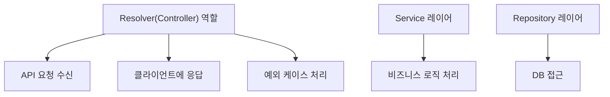
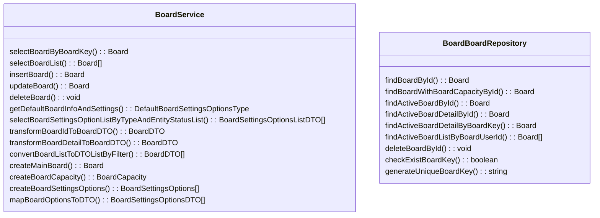
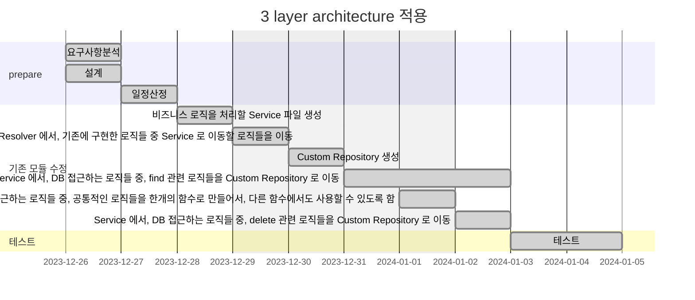

# 🚀 Project 관리

> mermaid로 작성된 과제는 마크다운 파일(Project.md)로 올려주시면 됩니다. (md 파일 내에 기존 구조를 넣어주세요)  
> 별도 아키택쳐나 모델링 도구를 사용한 경우에는 마크다운 파일(Project.md)과 png, gif, jpg, pdf 파일 형식으로 Project-{gitID}.png 파일명으로 upload 해주세요

# 요구사항

- [X] 개선하려는 프로젝트의 최종 설계
  - 3주차에 작성한 markdown파일을 그대로 사용
- [X] task list 도출
  - 3주차에 작성한 markdown파일을 그대로 사용
- [X] 일정 계획 문서 (WBS)
  - 3주차에 작성한 markdown파일을 그대로 사용
- [X] issue list
  - 프로젝트를 진행 하는 과정에서 발생한 이슈가 있다면 작성.

# 🚀미션

1. 3주차 미션에 진행된 ToBe 개선 프로젝트 WBS를 기반으로 향후 4주간 개선 작업을 진행한다.
2. 매주 토요일까지 개선된 프로젝트의 진행사항을 Github으로 PR을 요청하고 코치의 리뷰를 받는다.
    1. 미션을 진행하면서 기술적인 어려움이나 이슈사항이 있다면 이슈사항을 작성하고 리뷰를 진행한다.
    2. WBS상에서 진행된 과제들은 'Done'으로 상태를 update한다.
3. 이슈 사항이 있을 경우 설계의 수정이나 일정의 변경이 필요하면 수정 한다.
4. 수정된 계획을 기반으로 다음주 개선작업을 진행하고 1~4의 과정을 4주간 반복한다.

## 실무계선 Project

### 실무계선 Project 기대효과 분석

- Resolver 함수의 역할이 축소되어, 유지보수가 용이해짐
- MVC framework 를 도입함으로써, 프로젝트의 확장성이 높아짐
  - Service, Repository, Controller 를 분리
  - Service 에서는, 비즈니스 로직을 처리하고,
  - Repository 에서는, DB 접근을 처리하고,
  - Controller 에서는, 클라이언트에 응답을 처리함
- Repository의 경우, Custom Repository 를 만들어서, 공통적인 로직을 처리하여, 코드의 중복을 줄임

### 실무계선 Project 프로세스

### class diagram

- class diagram

### ERD

- 실무계선 Project 구조에서 변경되는 ERD를 작성한다.

=> ERD 는, 변경되지 않음

## Task List

1. 비즈니스 로직을 처리할 Service 파일 생성 - 자세하게 말고, 일단 큼지막하게만
2. Resolver 에서, 기존에 구현한 로직들 중 Service 로 이동할 로직들을 이동
3. Custom Repository 생성
4. Service 에서, DB 접근하는 로직들 중, find 관련 로직들을 Custom Repository 로 이동
5. Custom Repository 에서, DB 접근하는 로직들 중, 공통적인 로직들을 한개의 함수로 만들어서, 다른 함수에서도 사용할 수 있도록 함
6. Service 에서, DB 접근하는 로직들 중, delete 관련 로직들을 Custom Repository 로 이동

## WBS

- 산정 기준 : 2시간/일

1. 요구사항 분석 : 0.5d
2. 설계 : 0.5d
3. 일정산정: 1d
4. 비즈니스 로직을 처리할 Service 파일 생성: 1d
5. Resolver 에서, 기존에 구현한 로직들 중 Service 로 이동할 로직들을 이동: 1d
6. Custom Repository 생성: 0.5d
7. Service 에서, DB 접근하는 로직들 중, find 관련 로직들을 Custom Repository 로 이동: 2d
8. Custom Repository 에서, DB 접근하는 로직들 중, 공통적인 로직들을 한개의 함수로 만들어서, 다른 함수에서도 사용할 수 있도록 함: 1d
9. Service 에서, DB 접근하는 로직들 중, delete 관련 로직들을 Custom Repository 로 이동: 1d
10. 테스트: 2d

## Issue list

1. ~~기존 협의된 요구사항 이외의 추가 요구사항이 생김~~
2. ~~테스트 과정에서, 테스트 라이브러리 세팅부터 되어 있지 않아서, jest 세팅을 별도로 진행하였음. 기존에 작성된 테스트 코드가 있었으면, 테스트 과정이 좀 더 수월했을 듯 함~~
3. ~~초기에는 Custom Repository 를 만들지 않고, Service 에서 바로 DB 접근을 하였는데, 이 부분을 더 나누어서, Custom Repository 를 만들어서, Service 에서는, Custom Repository 를 호출하도록 중간에 구조를 변경하였음~~
4. ~~BoardService 에서도, 보드 권한 관련된 비즈니스 로직을 BoardPermissionService 로 분리하여서, 유지보수성을 높임~~
5. ~~transaction 이 필요한 Custom Repository 함수들의 경우, custom repository 의 함수의 파라미터로 transaction manager 를 받아서, transaction 내에서 수행하도록 추가함~~

