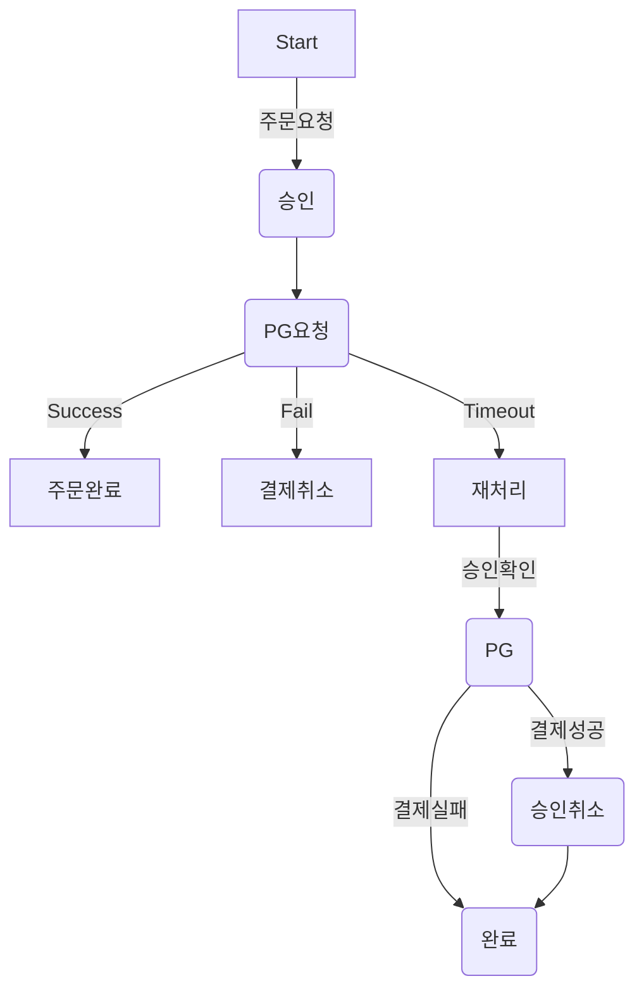
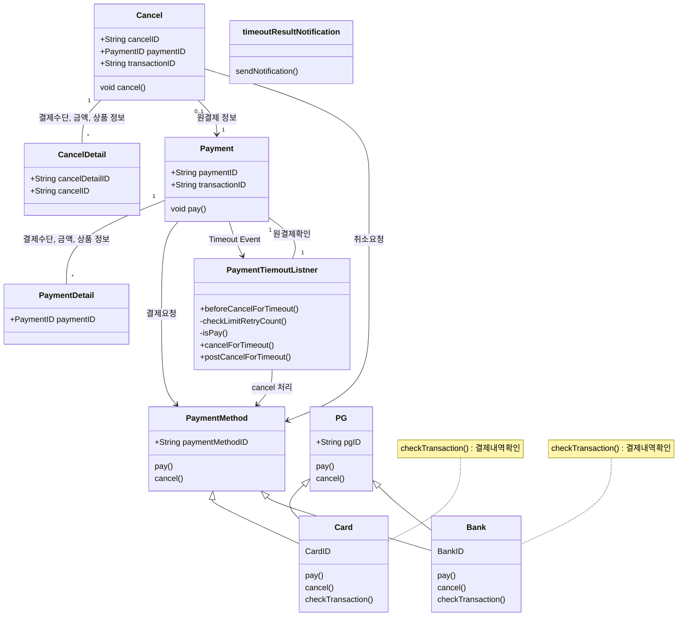
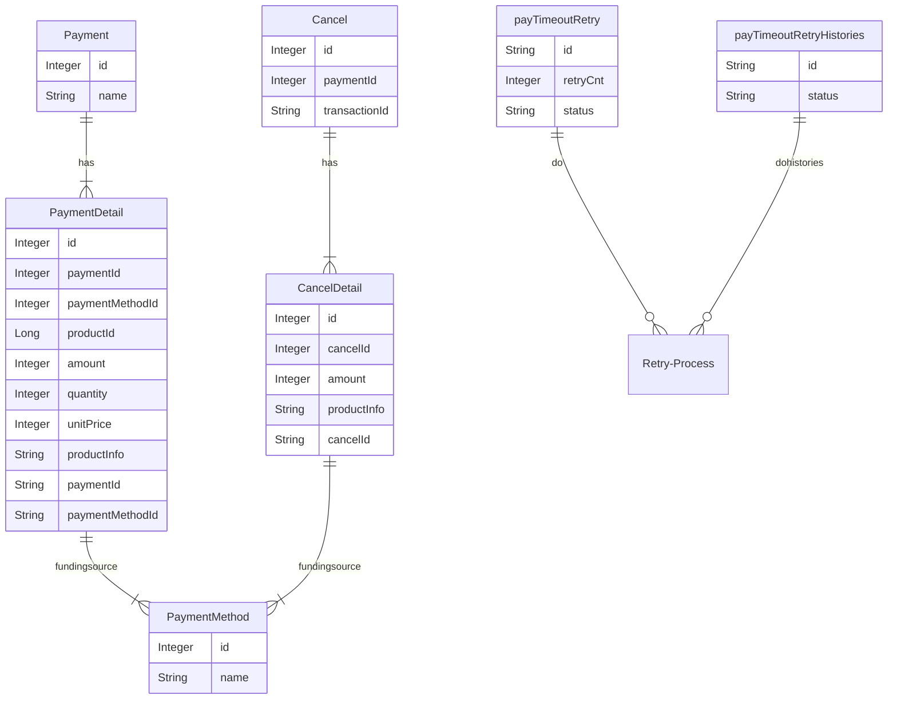
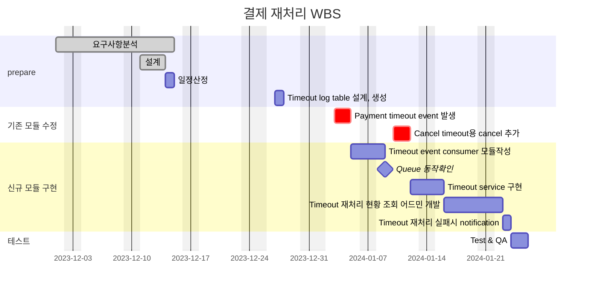

# 🚀 Project 관리
> mermaid로 작성된 과제는 마크다운 파일(Project.md)로 올려주시면 됩니다. (md 파일 내에 기존 구조를 넣어주세요)  
> 별도 아키택쳐나 모델링 도구를 사용한 경우에는 마크다운 파일(Project.md)과 png, gif, jpg, pdf 파일 형식으로 Project-{gitID}.png 파일명으로 upload 해주세요
# 요구사항
- [ ] 개선하려는 프로젝트의 최종 설계
    - 3주차에 작성한 markdown파일을 그대로 사용
- [ ] task list 도출
    - 3주차에 작성한 markdown파일을 그대로 사용
- [ ] 일정 계획 문서 (WBS)
   - 3주차에 작성한 markdown파일을 그대로 사용
- [ ] issue list
   - 프로젝트를 진행 하는 과정에서 발생한 이슈가 있다면 작성.

# 🚀미션
1. 3주차 미션에 진행된 ToBe 개선 프로젝트 WBS를 기반으로 향후 4주간 개선 작업을 진행한다.
2. 매주 토요일까지 개선된 프로젝트의 진행사항을 Github으로 PR을 요청하고 코치의 리뷰를 받는다.
    1. 미션을 진행하면서 기술적인 어려움이나 이슈사항이 있다면 이슈사항을 작성하고 리뷰를 진행한다.
    2. WBS상에서 진행된 과제들은 'Done'으로 상태를 update한다.
3. 이슈 사항이 있을 경우 설계의 수정이나 일정의 변경이 필요하면 수정 한다.
4. 수정된 계획을 기반으로 다음주 개선작업을 진행하고 1~4의 과정을 4주간 반복한다.

## 실무계선 Project
### 실무계선 Project 기대효과 분석
- timeout 건을 처리하는데 매일 소요되는 2시간의 업무 시간을 30분 내외로 줄일 수 있다.
- 사람이 직접 하는 부분을 자동화 하여 실수를 줄일 수 있다.
    - 가끔 결제가 되었는데 timeout건으로 나왔으나 수기처리시 누락된 경우 고객의 CS 클래임이 인입되고 좋지않은 고객경험을 준다.
    - timeout 갤제 CS인입건 1건/week 을 0건으로 줄일 수 있다.
- 익일 처리되던 프로세스를 5분단위의 batch로 처리하여서 고객만족을 줄 수 있다.
    - 주문은 실패 했지만 결제가 되었다는 CS 건 3건/week를 0건으로 줄일 수 있다.
 
### 실무계선 Project 프로세스

### class diagram
- class diagram

    

### ERD
- 실무계선 Project 구조에서 변경되는 ERD를 작성한다.

## Task List
1. Timeout 발생 시 Event발생 수정- SQS, SNS  
2. Timeout event subscription module 작성 
3. Timeout log table 설계, 생성 
4. Timeout 재처리 service 설개, 구현 
&nbsp; &nbsp; 1. transaction 성공여부 확인  
&nbsp; &nbsp; 2. transaction 취소 처리 하기 (결제시) 
&nbsp; &nbsp; 3. 재처리 logging(DB) : 처리 횟수(3회), 처리 내역 
5. Timeout 재처리 현황 조회 어드민 page. 
6. Timeout 재처리 실패시 메일 발송 모듈. 

## WBS
1. 요구사항 분석 : 이미수행
2. 설계 : 3d
3. 일정산정: 1d
4. Timeout 발생 시 Event발생 수정- SQS, SNS : 이미 사용하는 SQS가 있고 큐생성 및 기존코드 수정 : 2d
5. Timeout event subscription module 작성 : SQS, SNS : 이미 사용하는 SQS가 있고 신규 class 생성 : 2d
6. Timeout log table 설계, 생성 : 1d
7. Timeout 재처리 service 설개, 구현 : 2d
    1. transaction 성공여부 확인 : 0.5d
    2. transaction 취소 처리 하기 (결제시) : 0.5d
    3. 재처리 logging(DB) : 처리 횟수(3회), 처리 내역 : 1d
8. Timeout 재처리 현황 조회 어드민 page.: 기존 admin에 메뉴 추가 : 5d
9. Timeout 재처리 실패시 메일 발송 모듈: 기존 notification에 method 추가 : 1d

## Issue list
1. ~~일정 시작이 지연됨~~
    1. ~~Follow up : 1일 지연 - 추가 작업으로 완료~~
2. SQS 설정 지연
    1. Follow up : 1주 지연 - 주말 작업으로 1.5일까지 완료 예정

