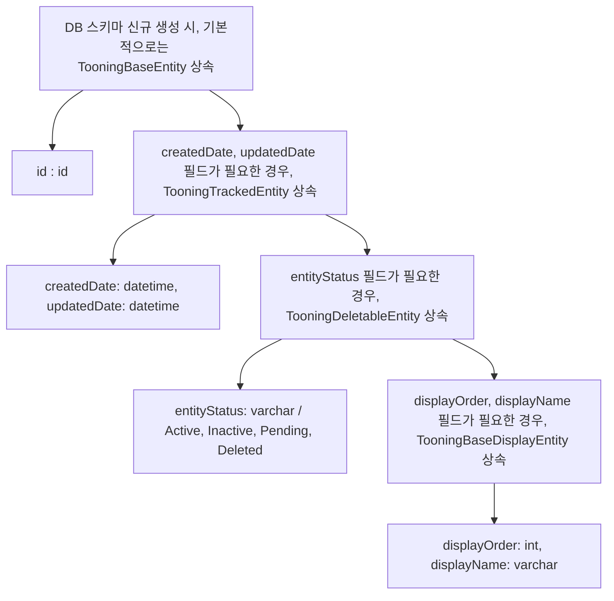

# 성과 정리(성과 작성)

> mermaid로 작성된 과제는 마크다운 파일(Result.md)로 올려주시면 됩니다. (md 파일 내에 기존 구조를 넣어주세요)  
> 별도 아키택쳐나 모델링 도구를 사용한 경우에는 마크다운 파일(Result.md)과 png, gif, jpg, pdf 파일 형식으로 Result-{gitID}.png 파일명으로 upload 해주세요

# 요구사항

- [X] 개선한 프로젝트의 최종 결과에 대한 성과를 작성 해본다.
  - [X] 진행 한 개선과제에 대한 간략한 설명을 한다.
  - [X] 개선 프로젝트를 시작할때 작성한 기대효과를 작성한다.
  - [X] 최종 완료된 과제의 성과를 수치화 하여 작성한다.

## 과제 설명

- 반복적으로 하고있는 업무 중 자동화 할 수 있거나 효율적으로 개선할 수 있는 개선된 프로세스를 작성한다.
- 변경이 되었을 때 어떤 효과가 있을것인지를 '기대효과'에 작성한다.

## 기대 효과

- 기대효과는 가급적 수치화된 데이터가 나오도록 작성한다.
- 과정기간내에 달성 가능한 목표를 잡아 본다.

## 성과

- 진행 한 과제에 대하여 개선 전/후를 비교하여 수치화 가능한 부분은 수치화로 한다.
- Refactoring
  - 확장성을 고려한 개선이라면 변경 전/후로 동일한 작업에 소요되는 시간을 측정 (유지보수성)
  - 코드 품질을 개선한 것이라면 [SonarQube](https://www.sonarsource.com/products/sonarqube/), [SpotBugs](https://spotbugs.github.io/) 같은 정적 분석툴의 정량적 수치를 이용 (TDD)
- 프로세스 개선
  - 변경 전/후 로 개선된 프로세스에서 절감 되는 비용(시간, 고객만족도, 서버비용...)을 수치화 한다.
  - '비효율의 숙달화' 같은 것은 수기로 했을 경우 비용과 사람이 처리하면서 발생할 휴먼에러를 강조 한다.
- 구조 개선
  - 성능을 개선 하였다면 개선 전/후 성능테스트([nGrinder](https://naver.github.io/ngrinder/), [Jmeter](https://jmeter.apache.org/), [LoadRunner](https://www.microfocus.com/ko-kr/portfolio/performance-engineering/overview), [Gatling](https://gatling.io/)...) 수치를 활용한다.( **개선 전 수치 측정을 하지 않는 경우가 종종 있으니 배포 전 꼭 측정 하도록 한다** )
    - 시스템 안정성을 개선 했다면 개선 전/후  동일(유사) 장애 건수를 활용할 수 있다.
- 서비스 개선
  - 기능을 개선하였다면
        - 매출 증대 : 주문건수, 주문 금액... ( **개발에서만 기여한 부분은 아니지만 개발도 기여한 부분이다.** )
        - 고객의 체류시간 (UI/UX 개선을 하였다면 주문시간이 단축 한다거나 직관적인 UI로 다음 진행이 빨라 질 것이다.)
        - page 렌더링 속도
    - 고객에 영향을 받는 부분이라면 **A/B Test**를 활용한다면 수치화가 용이하다.
- 기타
  - 최대한 수치화 할 수 있는 부분을 고민해보고 특별한 경우 성공/실패로 처리할 수 있고

# 예시

## 과제 설명

- 신규 기능을 위한 DB 스키마를 생성할 때, 각 테이블의 성격에 따라, 적절한 Base Entity를 상속받아서 사용하도록 한다. (TooningBaseEntity, TooningTrackedEntity, TooningDeletableEntity, TooningBaseDisplayEntity)

- 목표 : 테이블 생성시, 1시간 소요되는 작업을 30분으로 줄이고, migration 파일 검토 시간도 줄인다.

## 기대 효과

- 신규 테이블 생성시, Base Entity를 상속받아서, 사용하면, DB 칼럼명, 타입을 변경할 때, 편리함
- 자주 사용하는 칼럼의 경우, 용어 통일이 가능함
- id, createdDate, updatedDate, entityStatus, displayOrder, displayName 등의 필드의 타입, 칼럼명에 대해 고민하지 않고, 통일된 방식으로 사용할 수 있으며, 휴먼 에러를 0건으로 줄일 수 있다.
- 테이블 생성시, 1시간 소요되는 작업을 30분으로 줄일 수 있다. 실제로, 이전에는 테이블 생성시, 1시간 소요되었으나, Base Entity를 사용하면서, 30분 이내로 줄었으며, migration 파일 검토 시간도 줄어들었다.

## 성과

- 기능 개발시, 신규 테이블 생성 작업 시간 감소
  - 1시간 &rarr; 30분
  - migration 파일 검토 시간 감소
  - 30분 &rarr; 10분
- 칼럼 명, 타입 관련하여, 통일성 확보
  - 휴먼 에러 0건
  - 테이블 생성시, 칼럼명, 타입에 대한 고민 0건
