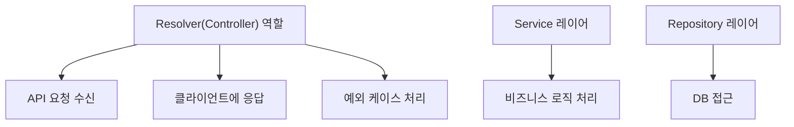

# 성과 정리(성과 작성)

> mermaid로 작성된 과제는 마크다운 파일(Result.md)로 올려주시면 됩니다. (md 파일 내에 기존 구조를 넣어주세요)  
> 별도 아키택쳐나 모델링 도구를 사용한 경우에는 마크다운 파일(Result.md)과 png, gif, jpg, pdf 파일 형식으로 Result-{gitID}.png 파일명으로 upload 해주세요

# 요구사항

- [X] 개선한 프로젝트의 최종 결과에 대한 성과를 작성 해본다.
  - [X] 진행 한 개선과제에 대한 간략한 설명을 한다.
  - [X] 개선 프로젝트를 시작할때 작성한 기대효과를 작성한다.
  - [X] 최종 완료된 과제의 성과를 수치화 하여 작성한다.

## 과제 설명

- 반복적으로 하고있는 업무 중 자동화 할 수 있거나 효율적으로 개선할 수 있는 개선된 프로세스를 작성한다.
- 변경이 되었을 때 어떤 효과가 있을것인지를 '기대효과'에 작성한다.

## 기대 효과

- 기대효과는 가급적 수치화된 데이터가 나오도록 작성한다.
- 과정기간내에 달성 가능한 목표를 잡아 본다.

## 성과

- 진행 한 과제에 대하여 개선 전/후를 비교하여 수치화 가능한 부분은 수치화로 한다.
- Refactoring
  - 확장성을 고려한 개선이라면 변경 전/후로 동일한 작업에 소요되는 시간을 측정 (유지보수성)
  - 코드 품질을 개선한 것이라면 [SonarQube](https://www.sonarsource.com/products/sonarqube/), [SpotBugs](https://spotbugs.github.io/) 같은 정적 분석툴의 정량적 수치를 이용 (TDD)
- 프로세스 개선
  - 변경 전/후 로 개선된 프로세스에서 절감 되는 비용(시간, 고객만족도, 서버비용...)을 수치화 한다.
  - '비효율의 숙달화' 같은 것은 수기로 했을 경우 비용과 사람이 처리하면서 발생할 휴먼에러를 강조 한다.
- 구조 개선
  - 성능을 개선 하였다면 개선 전/후 성능테스트([nGrinder](https://naver.github.io/ngrinder/), [Jmeter](https://jmeter.apache.org/), [LoadRunner](https://www.microfocus.com/ko-kr/portfolio/performance-engineering/overview), [Gatling](https://gatling.io/)...) 수치를 활용한다.( **개선 전 수치 측정을 하지 않는 경우가 종종 있으니 배포 전 꼭 측정 하도록 한다** )
    - 시스템 안정성을 개선 했다면 개선 전/후  동일(유사) 장애 건수를 활용할 수 있다.
- 서비스 개선
  - 기능을 개선하였다면 
        - 매출 증대 : 주문건수, 주문 금액... ( **개발에서만 기여한 부분은 아니지만 개발도 기여한 부분이다.** )
        - 고객의 체류시간 (UI/UX 개선을 하였다면 주문시간이 단축 한다거나 직관적인 UI로 다음 진행이 빨라 질 것이다.)
        - page 렌더링 속도
    - 고객에 영향을 받는 부분이라면 **A/B Test**를 활용한다면 수치화가 용이하다.
- 기타
  - 최대한 수치화 할 수 있는 부분을 고민해보고 특별한 경우 성공/실패로 처리할 수 있고

# 예시

## 과제 설명

- Resolver 함수의 역할을 축소시키고, MVC framework 를 도입하여, 프로젝트의 확장성을 높이고,
- Repository의 경우, Custom Repository 를 만들어서, 공통적인 로직을 처리하여, 코드의 중복을 줄인다.
- Board, Group, Post, BoardUser, BoardPermission, Comment 등의 도메인에 대한 Service, Repository, Controller 를 분리하여, 확장성을 높인다.

- 목표 : Resolver 함수의 역할을 축소시키고, MVC framework 를 도입하여, 프로젝트의 확장성을 높이고, 이후 신규 기능 추가 시, api CRUD 를 2일 걸리던 작업을 1일로 줄인다.

## 기대 효과

- Resolver 함수의 역할이 축소되어, 유지보수가 용이해짐
- MVC framework 를 도입함으로써, 프로젝트의 확장성이 높아짐
  - Service, Repository, Controller 를 분리
  - Service 에서는, 비즈니스 로직을 처리하고,
  - Repository 에서는, DB 접근을 처리하고,
  - Controller 에서는, 클라이언트에 응답을 처리함
- Repository의 경우, Custom Repository 를 만들어서, 공통적인 로직을 처리하여, 코드의 중복을 줄임
- BoardPermissionService 를 분리하여, Board 내에서의 권한 체크 로직을 매번 작성하지 않고, BoardPermissionService 의 메소드를 호출하여, 권한 체크를 수행하도록하여, 코드의 중복을 줄이고, 권한 체크 관련한 에러 코드, 메세지를 통일하여, 유지보수성을 높인다.
- Custom Repository 의 함수들 중, 값이 자주 변하지 않는 함수들을 Cache 를 적용하여, 성능을 향상시킨다. ex) 보드내부 설정들의 옵션 리스트 조회 함수 등
- Post 생성, 수정, 삭제 시, Board 의 용량 정보를 수정하는 로직에서, transaction 이 필요한 함수의 경우, custom repository 의 함수의 파라미터로 transaction manager 를 받아서, transaction 을 수행하도록 하여, 코드의 중복을 줄임

## 성과

- 이후 신규 기능 추가 시, api CRUD 를 2일 걸리던 작업을 1일로 줄임
  - Board 내에서, Permission 체크하는 코드 약 14 줄을 15군데에 작성하던 것을, BoardPermissionService 의 메소드를 호출하여, 1군데에 작성하여, 코드의 중복을 줄임
- CRUD api 코드에서, transaction manager 를 매번 선언하지 않아도 되어, 코드의 중복을 줄임
  - 코드 약 18줄을 3군데에 작성하던 것을, Util Service 에서, transaction manager 를 받아서, transaction 을 수행하는 로직을 1군데에 작성하여, 코드의 중복을 줄임
- Custom Repository 의 함수들 중, 값이 자주 변하지 않는 함수들을 Cache 를 적용하여, 성능을 향상시킴
  - Cache 를 적용하여, 조회 속도를 2배 향상시킴

