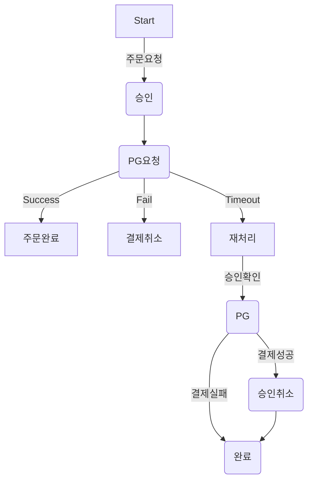

# 성과 정리(성과 작성)
> mermaid로 작성된 과제는 마크다운 파일(Result.md)로 올려주시면 됩니다. (md 파일 내에 기존 구조를 넣어주세요)  
> 별도 아키택쳐나 모델링 도구를 사용한 경우에는 마크다운 파일(Result.md)과 png, gif, jpg, pdf 파일 형식으로 Result-{gitID}.png 파일명으로 upload 해주세요
# 요구사항
- [ ] 개선한 프로젝트의 최종 결과에 대한 성과를 작성 해본다.
    - [ ] 진행 한 개선과제에 대한 간략한 설명을 한다.
    - [ ] 개선 프로젝트를 시작할때 작성한 기대효과를 작성한다.
    - [ ] 최종 완료된 과제의 성과를 수치화 하여 작성한다.
    
## 과제 설명
- 반복적으로 하고있는 업무 중 자동화 할 수 있거나 효율적으로 개선할 수 있는 개선된 프로세스를 작성한다.
- 변경이 되었을 때 어떤 효과가 있을것인지를 '기대효과'에 작성한다.
## 기대 효과
- 기대효과는 가급적 수치화된 데이터가 나오도록 작성한다.
- 과정기간내에 달성 가능한 목표를 잡아 본다.
## 성과
- 진행 한 과제에 대하여 개선 전/후를 비교하여 수치화 가능한 부분은 수치화로 한다.
- Refactoring
    - 확장성을 고려한 개선이라면 변경 전/후로 동일한 작업에 소요되는 시간을 측정 (유지보수성)
    - 코드 품질을 개선한 것이라면 [SonarQube](https://www.sonarsource.com/products/sonarqube/), [SpotBugs](https://spotbugs.github.io/) 같은 정적 분석툴의 정량적 수치를 이용 (TDD)
- 프로세스 개선
    - 변경 전/후 로 개선된 프로세스에서 절감 되는 비용(시간, 고객만족도, 서버비용...)을 수치화 한다.
    - '비효율의 숙달화' 같은 것은 수기로 했을 경우 비용과 사람이 처리하면서 발생할 휴먼에러를 강조 한다.
- 구조 개선
    - 성능을 개선 하였다면 개선 전/후 성능테스트([nGrinder](https://naver.github.io/ngrinder/), [Jmeter](https://jmeter.apache.org/), [LoadRunner](https://www.microfocus.com/ko-kr/portfolio/performance-engineering/overview), [Gatling](https://gatling.io/)...) 수치를 활용한다.( **개선 전 수치 측정을 하지 않는 경우가 종종 있으니 배포 전 꼭 측정 하도록 한다** )
    - 시스템 안정성을 개선 했다면 개선 전/후  동일(유사) 장애 건수를 활용할 수 있다.
- 서비스 개선
    - 기능을 개선하였다면 
        - 매출 증대 : 주문건수, 주문 금액... ( **개발에서만 기여한 부분은 아니지만 개발도 기여한 부분이다.** )
        - 고객의 체류시간 (UI/UX 개선을 하였다면 주문시간이 단축 한다거나 직관적인 UI로 다음 진행이 빨라 질 것이다.)
        - page 렌더링 속도
    - 고객에 영향을 받는 부분이라면 **A/B Test**를 활용한다면 수치화가 용이하다.
- 기타
    - 최대한 수치화 할 수 있는 부분을 고민해보고 특별한 경우 성공/실패로 처리할 수 있고

# 예시
## 과제 설명
- PG와 연결하는 결제 모듈에서 평균 2회/일 정도 Timeout이 발생 하는 경우 개발자가 수기로 처리 하기위한 비용이 발생(약 2시간) 하는 부분을 자동화 한다.
    - Timeout 발생 시 매번 해당 승인 건을 PG사 관리자 페이지에서 결제가 완료 되었는지 확인. (Timeout 발생시 고객에게 주문 실패로 안내) : 소요시간(10분)
        - Case 1 : 해당 결제가 성공 하었다면 취소를 수작업으로 진행 : 소요시간(10분)
        - Case 2 : 해당 결제가 실패 하였다면 별도 수기작업 없음
    - Case1 에 대한 건을 회계상 반영을 위해 결제 DB를 수정 (승인, 취소) : 소요시간(20분)
    - Case1에 대하여 고객에게 결제-취소 되었다는 안내(email, sms, app push) 처리 : 소요시간(10분)
- 목표 : 투입되는 리소스를 절감(1시간/1일) 하고 결제-취소 발생 지연으로 인한 고객의 클래임 건수(3건/1주)를 감소한다. 

## 기대 효과
- timeout 건을 처리하는데 매일 소요되는 2시간의 업무 시간을 줄일 수 있다.
- 사람이 직접 하는 부분을 자동화 하여 실수를 줄일 수 있다.
    - 가끔 결제가 되었는데 timeout건으로 나왔으나 수기처리시 누락된 경우 고객의 CS 클래임이 인입되고 좋지않은 고객경험을 준다.
    - timeout 갤제 CS인입건 1건/1주 을 0건으로 줄일 수 있다.
- 익일 처리되던 프로세스를 5분단위의 batch로 처리하여서 고객만족을 줄 수 있다.
    - 주문은 실패 했지만 결제가 되었다는 CS 건 3건/week를 0건으로 줄일 수 있다.
## 성과
- PG Timeout 발생 시 비용절감
    - 일 2시간 수기처리 업무 비용 감소 
    - 2시간 &rarr; 0분
- 고객 만족도 증가
    - timeout 고객 CS문의(클래임) 3건/1주 &rarr; 0건
    - timeout 결제 실패시 실시간 취소처리 : cs 문의 1건/1주 &rarr; 0건
- 수기 오처리로 인한 휴먼에러 제거
    - 1건/월 &rarr; 0건
